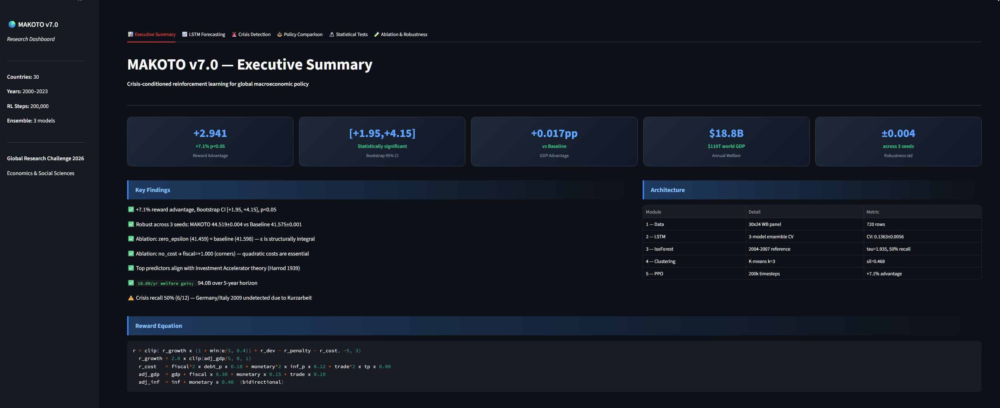

# MAKOTO
Crisis-conditioned RL framework for global macroeconomic policy optimization

## Multi-Agent Extension: United States & China

A two-country parameter-sharing PPO extension applying the same 
crisis-conditioned architecture to simultaneous policy optimization 
for the world's two largest economies.

**Key result:** Combined MAKOTO advantage = +12.185 ± 1.390  
Bootstrap 95% CI: [+11.830, +18.137], p < 0.05 across 3 seeds  
Unconditioned baseline converges to contractionary policy in every 
economic epoch for both countries simultaneously.
